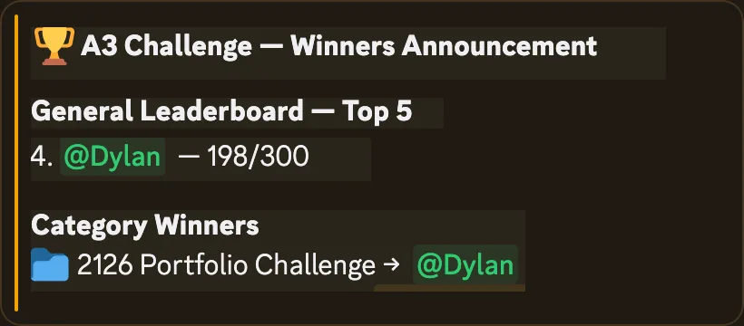

# INVISIBLE // 2126

A futuristic anonymous portfolio built for the A3 2126 Portfolio Challenge. The site presents a redacted builder profile as a classified archive from 2126, with coded project records, a local interactive terminal, responsive motion, and static deployment on A3.

[Live site](https://invisible-2126.vercel.app/)

## Recognition

- A3 Web Design Challenge - 2126 Portfolio Category Winner
- 4th Overall, 198/300



## Built For

[A3 Web Design Challenge](https://luma.com/cewxxl63), a 48-hour web design challenge to build, deploy, and submit a real website on A3.

## Highlights

- Classified archive visual system with redacted identity and operator-file framing.
- Responsive single-page interface with polished motion and reduced-motion support.
- Interactive local terminal with deterministic commands and no backend requirement.
- Static-friendly Next.js export mirrored into `public` for A3 hosting.
- Fictional contact details and anonymous framing by design.

## Stack

- Next.js 16
- React 19
- TypeScript
- Tailwind CSS 4
- Static export
- A3 deployment

## Run Locally

```bash
bun install
bun run dev
```

Open `http://localhost:3000`.

## Checks

```bash
bun run lint
bun run build
```

## Deployment

This is a static-friendly Next.js App Router page with no backend, database, auth, payments, external API requirement, or external font fetch.

For A3 static hosting:

- Install command: `bun install`
- Build command: `bun run build`
- Output directory: `public`

The build emits the canonical Next static export to `out`, then mirrors it into `public` because A3's ICP deploy step reads assets from `public`.

## Privacy

The anonymous identity is intentional. The project uses fictional contact details and does not require secrets or private runtime configuration.
